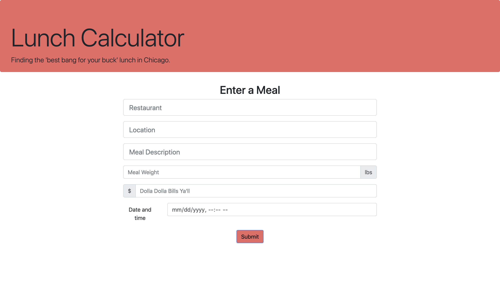
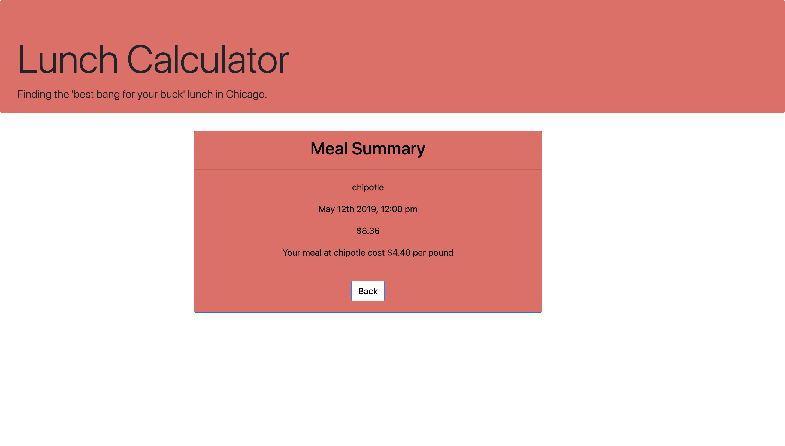
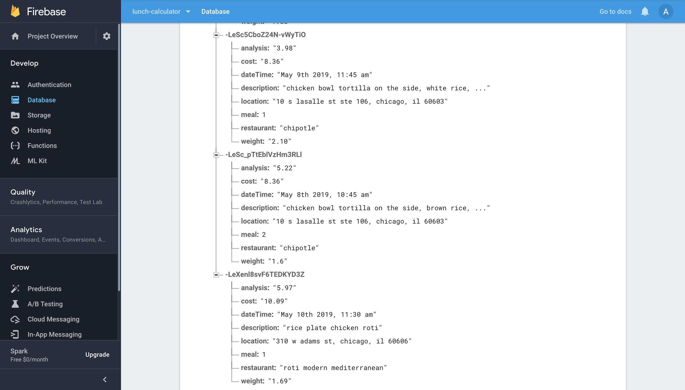

# lunch-calculator
There's nothing worse than paying $15.00 for lunch in Chicago and being hungry two hours later. The lunch calculator is an ongoing project to find the best bargain on lunch. Users input the restaurant, meal description, weight, and cost of the meal; the data is stored in the Firebase database and users are returned an analysis of the cost per pound of their meal. I'm going to use the data to generate data visualizations of the best bargain lunch spots in Chicago.

# Deployment
The app is currently deployed on GitHub pages @ https://bee25141.github.io/lunch-calculator/

# Built With
Bootstrap - The CSS framework used.
Firebase for storing data.
JavaScript.
CSS.
HTML.

# Authors
Tony Bee