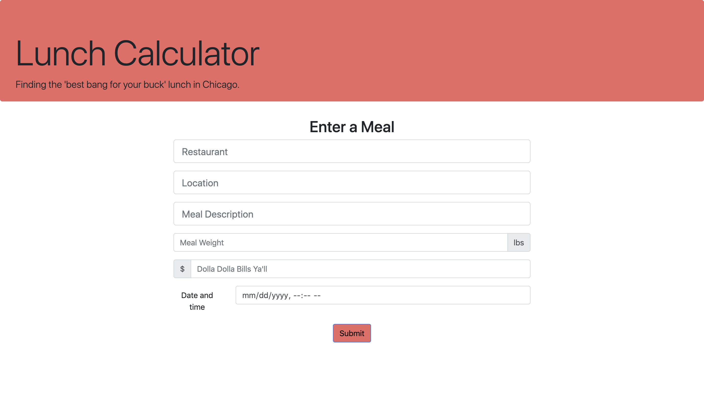
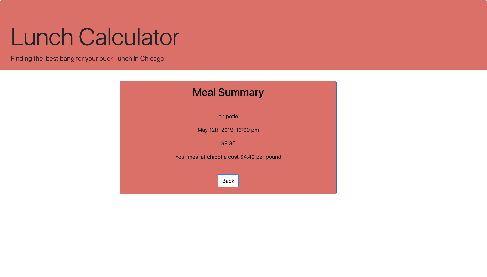

# Lunchbox Chi
There's nothing worse than paying $15.00 for lunch in Chicago and being hungry two hours later. The lunch calculator is an ongoing project to find the best bargain on lunch. Users input the restaurant, meal description, weight, and cost of the meal; the data is stored in an AWS RDS MySQL database and users are returned an analysis of the cost per pound of their meal. The project is currently a Node.js Express application running on an AWS EC2 instance, but in the future I'm looking to rebuild the front end with React, and experiment with serverless architecture using API Gateway and Lambda functions to communicate with a DynamoDB database.

# Deployment
(Under Construction)

# Built With
Amazon Web Services EC2 and RDS MySQL  
Node.js and Express.js  
d3.js  
Bootstrap - The CSS framework used.  
JavaScript & jQuery  
HTML 

# Authors
Tony Bee