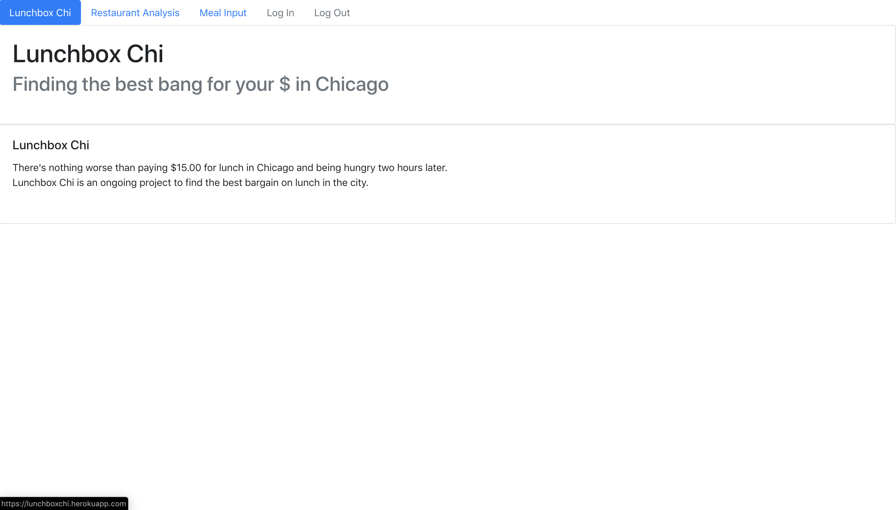
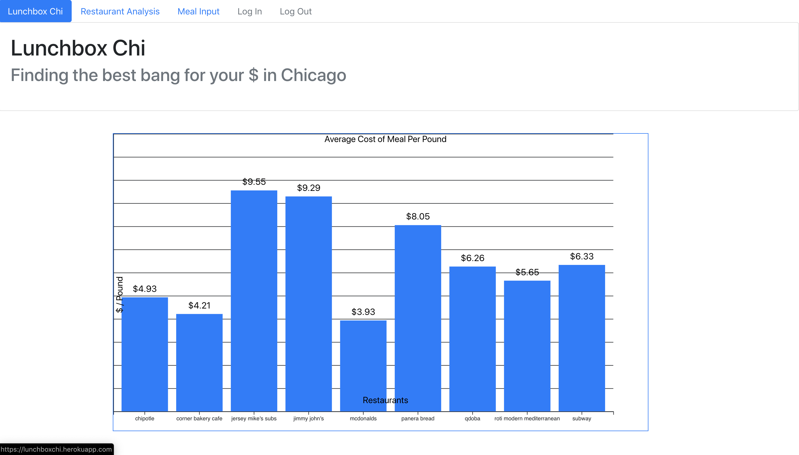
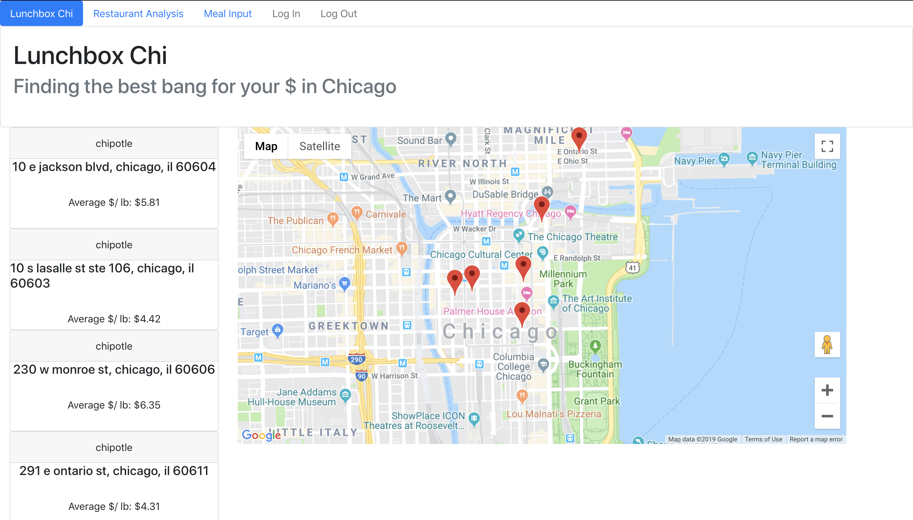

# Lunchbox Chi
There's nothing worse than paying $15.00 for lunch in Chicago and being hungry two hours later. Lunchbox Chi is an ongoing project to find the best bargain for lunch in the city. Users input the restaurant, meal description, weight, and cost of the meal; the data is stored in an MySQL database and users are returned an analysis of the cost per pound of their meal. Total restaurant averages are displayed with a bar graph built using d3.js, and upon clicking the individual bars users are presented with individual restaurant averages, geographically displayed using the Google Maps React API.  
 
I've been continually rebuilding the project with new technologies as I learn them. The project is currently a Node.js/Express application built with a React.js front end, RDS MySQL database, and Nginx for reverse proxy. Deployment was done on AWS using Docker for containerization, AWS ECS for multi container deployment and AWS ECR for contianer registry; but in the near future I'm looking to experiment with serverless architecture using API Gateway and Lambda functions to communicate with a DynamoDB database. Previous iterations included a vanilla javascript application using a Firebase database, which was soon rebuilt with the addition of a Node.js backend and AWS RDS MySQL database and launched on an EC2 instance. Following that iteration the project was 

# Deployment
http://34.226.155.139/

# Built With
Amazon Web Services ECS, RDS for MySQL, and ECR  
Docker  
React.js 
Node.js and Express.js  
Nginx  
d3.js  
Google Maps API  
Bootstrap - The CSS framework used.  
JavaScript  
HTML  

# Authors
Tony Bee